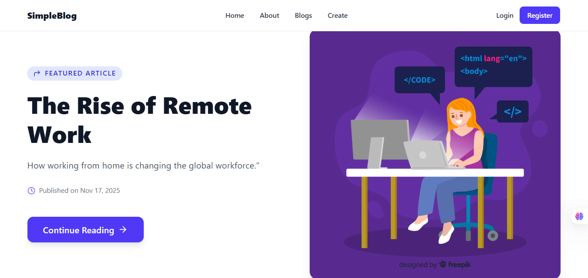

# SimpleBlog

A minimal blogging platform built with **Next.js, Tailwind CSS, and MongoDB** — focused on writing, reading, and sharing content quickly.

---

## 🔗 Live Demo

---

## 📝 Key Features

- ✍️ Write & publish articles
- 📖 Read & explore blogs
- ⚡ Fast & responsive design
- 💾 MongoDB backend

---

## 🛠 Tech Stack

Next.js | React | Tailwind CSS | MongoDB | Vercel

---

## 📸 Screenshot

*(Replace with an actual screenshot from your app)*
